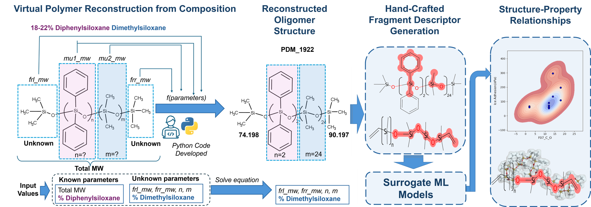

# Low-Regime Data Models for Ice Adhesion prediction

Author: Gerardo M Casanola-Martin

-------------------------------------------------------------------------------------------------

** MLR structural fragment model to predict ice adhesion on silicone oil systems DMDP or DMPM systems**

The IcePredict SilOil ML predictor is a Web App that use MLR regression models to predict ice adhesion performance. 
